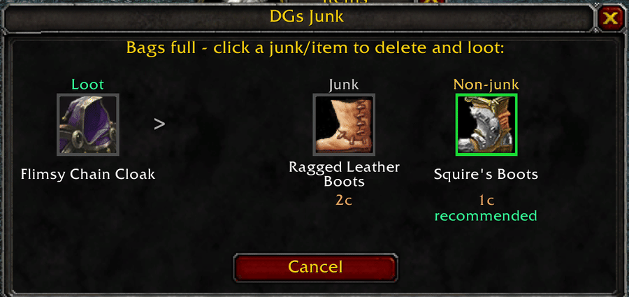
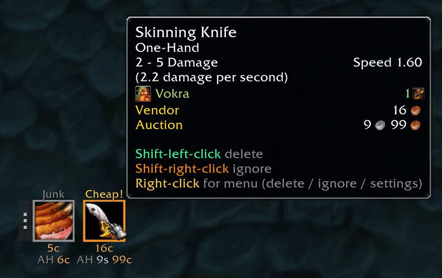
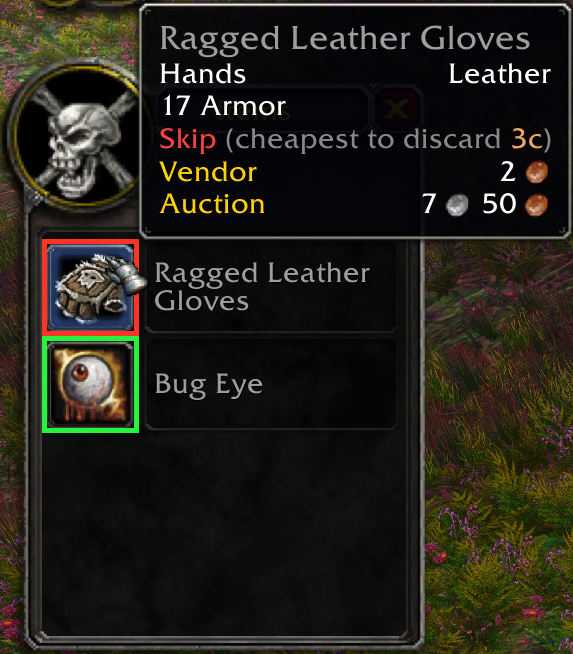
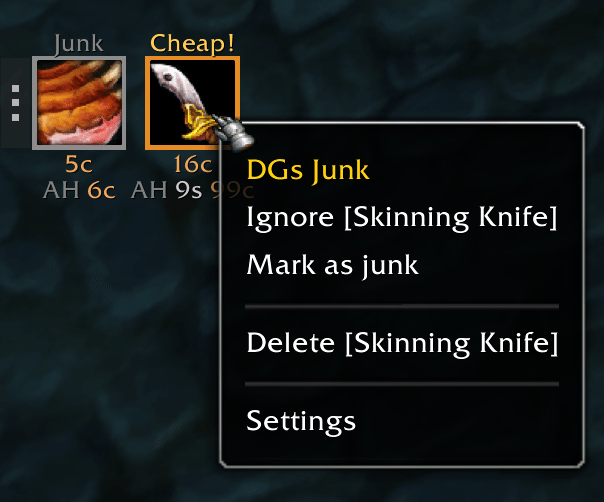
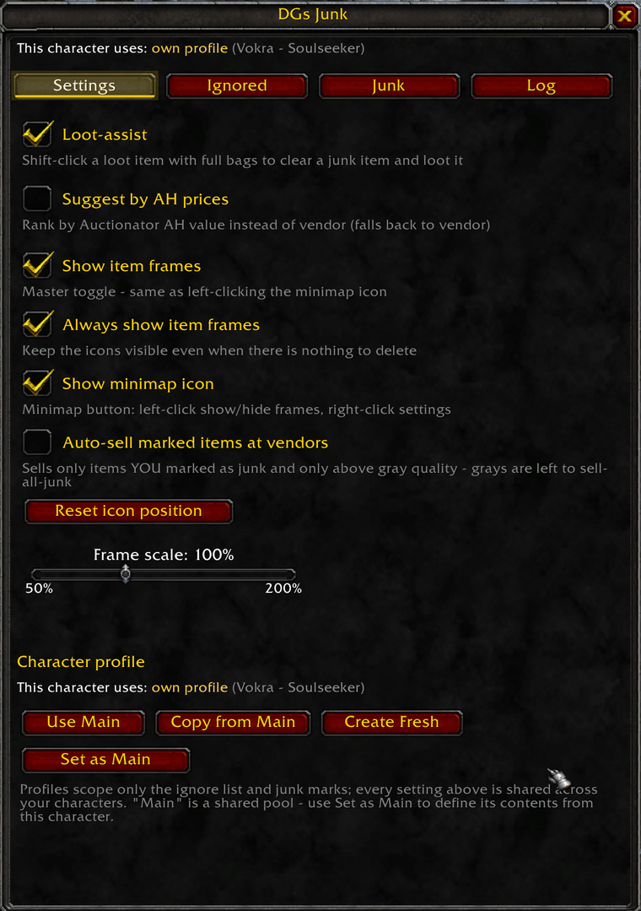
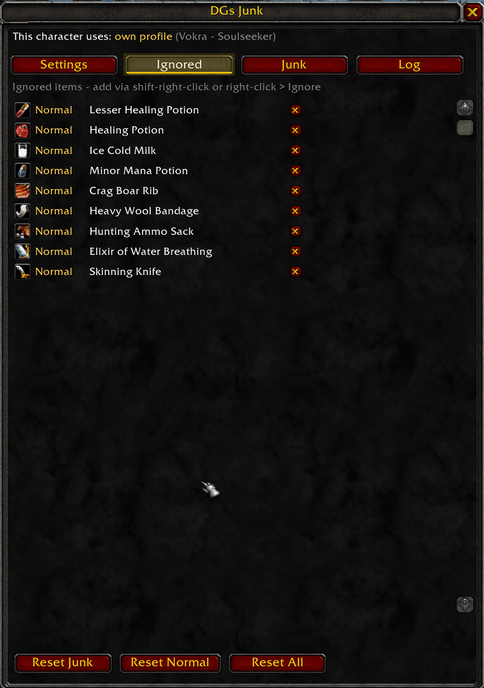

# DGs Junk

A lightweight bag-cleanup helper for **WoW Classic Era / Hardcore** (interface 11509, patch 1.15.9).
Standalone. [Auctionator](https://www.curseforge.com/wow/addons/auctionator) is optional and only
used for auction-house prices.

Download on **[CurseForge](https://www.curseforge.com/wow/addons/dgs-junk)**.



Bags full? Click the loot and DGs Junk shows what it would cost you: the loot on the left, your
cheapest junk and cheapest non-junk on the right with prices, the cheaper one recommended.

## What it does

Bag space is the real currency in Classic. DGs Junk always knows the two items you should throw away
first, and tells you, at the moment you need to decide, whether the thing you just looted is worth
more than the worst thing you are already carrying.



Two icons, always current: your cheapest junk and your cheapest non-junk item, each with vendor and
auction-house value. Hover for the item tooltip and the available actions.

## Features

- **Two floating icons**
  - **Junk**, the cheapest item you consider junk: gray (Poor) quality, plus anything you marked yourself.
  - **Normal**, the cheapest *non-junk* item, shown independently. Stuff you never flagged that is
    quietly worth less than your trash. Hidden when nothing qualifies.
- **Icon interactions**
  - **Shift-left-click**, delete that item. Grays go instantly, whites raise Blizzard's confirm,
    and anything green or better asks once more first, naming the rarity in its own colour.
  - **Shift-right-click**, ignore the item (persistent, categorised Junk / Normal).
  - **Right-click**, context menu: Mark / Unmark as junk, Delete, Ignore, Settings.
  - Drag the grip handle to move both icons. Scale is adjustable.
- **Loot verdict**. Hovering an item in the loot window tells you *Loot it* or *Skip*, judged
  against the cheapest thing you would have to discard, the same item the full-bags dialog
  recommends, so the two can never disagree. Quest items always read **Quest item: Take it!**
- **Coloured loot rows**. The loot window itself is tinted per row: green when the item is worth
  more than your cheapest junk, red when it is not, so you can read the whole window at a glance
  without hovering anything.
- **Full bags?** Clicking a loot item with no free slot opens a pick-an-item dialog: the loot on
  the left, your cheapest junk and cheapest non-junk on the right with both prices, the cheaper one
  recommended. Limited to Common quality and below, so the deletion is instant.
  - Not the item you wanted to lose? Page through the next-cheapest ones with the arrows either
    side of an icon, or the mouse wheel over it, up to ten per side. It opens on the cheapest and
    stops at both ends, so nothing wraps round to something expensive.
  - Each item appears once, not once per bag slot, and you are offered its smallest stack.
  - **Right-click** an item to ignore it, **shift-right-click** to skip the menu. It drops out of
    the list and the next candidate takes its place.
- **Opening things with full bags.** A container that opens into a loot window (a clam, a lockbox)
  is never offered as the item to destroy while you are looting it: it stays in your bag until its
  contents are taken, and destroying it would take them with it. Nor is anything the game has
  locked, since deleting a locked item silently does nothing.
  - Should a container refuse to open at all for want of a slot, you get the same pick-an-item
    dialog, and once a slot is free the addon opens it for you. The contents cannot be seen in
    advance, so it says *contents unknown* rather than pricing the container. Whatever lands in
    your bags is listed with its value. On by default, switch in the settings.
- **Junk-coin overlay**. Items *you* marked get a small coin in the bag slot's corner. Works with
  Bagnon and the default bags, and is purely additive: it never overwrites rarity borders.
- **Vendor auto-sell** (opt-in, off by default). Sells only items you marked yourself and only
  above gray quality, so it can never fight another gray-seller.
- **Junk tab**. Every marked junk item currently in your bags, aggregated. The X unmarks a row and
  *Clear all junk* unmarks the lot; nothing on this tab touches your bags.
- **Profiles**. Settings are account-wide. The ignore list and junk marks live either in the shared
  **Default** profile or in this character's own, picked from a dropdown. Both always exist, and
  *Copy from Default* / *Copy to Default* move entries between them.

- **English and German**. The language follows the client by default; a picker in the settings
  (*Automatic* / *English* / *Deutsch*) overrides it either way. Picking one asks before reloading
  your interface, and declines while you are in combat. An untranslated line falls back to English
  rather than rendering blank.

Quest items are never suggested, never auto-sold and never deletable, even if marked.

## Screenshots

<table>
<tr>
<td width="50%" valign="top">

<p>Hovering loot gives a verdict against your cheapest discardable item, and every row is tinted green or red so the window reads at a glance.</p>
</td>
<td width="50%" valign="top">

<p>Right-click menu. Ignore and Mark sit together, Delete is fenced off by dividers.</p>
</td>
</tr>
<tr>
<td width="50%" valign="top">

<p>Every toggle in one place, plus the profile picker.</p>
</td>
<td width="50%" valign="top">

<p>The ignore list, categorised Junk / Normal, with per-row removal and bulk resets.</p>
</td>
</tr>
</table>

## Worth calculation

Items are ranked by real worth: vendor price, or the Auctionator AH price when *Suggest by AH* is
enabled and data exists. Both sides of the comparison are measured as a **stack total**, because a
bag slot holds a whole stack: destroying a slot costs you all of it, and looting one gains you all
of it. A stack of 4 meat is judged as 4, against the full value of the stack you would discard.

## Slash commands

| Command | Action |
|---|---|
| `/dgjunk` | open the settings window |

Loot-assist, debug logging and clearing the log are toggled inside that window
(**Settings** and **Log** tabs).

## Settings window

- **Settings** (opens here), loot-assist, container assist, colour loot rows, suggest-by-AH, show item frames,
  always-show, minimap button, auto-sell, frame scale, the profile dropdown and its copy buttons,
  reset icon position.
- **Ignored**, manage the ignore list (remove individual entries, or reset Junk / Normal / All).
- **Junk**, the mark list described above.
- **Log**, scrollable, copyable diagnostic log. Debug messages go here, never to chat.

Destructive buttons confirm first. Hold **Shift** to skip the confirmation.

## Install

Copy the `DGsJunk` folder into:

```
World of Warcraft\_classic_era_\Interface\AddOns\
```

Then restart the client. WoW only scans for new addon folders at startup. Later updates to an
existing install need only `/reload`.

## Notes

- Built for the 1.15.9 UI: uses `TooltipUtil.GetDisplayedItem` for loot tooltips and
  `MenuUtil.CreateContextMenu` for context menus, with legacy fallbacks.
- Close buttons call `Hide()` directly rather than going through `HideUIPanel`, so both windows can
  be closed in combat.
- No external libraries, no LibDBIcon. The minimap button is self-contained.
